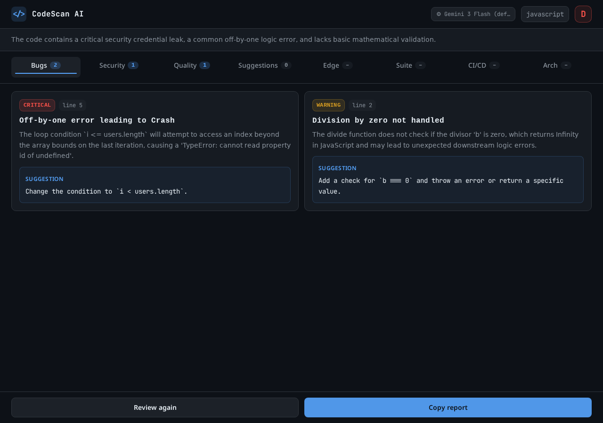
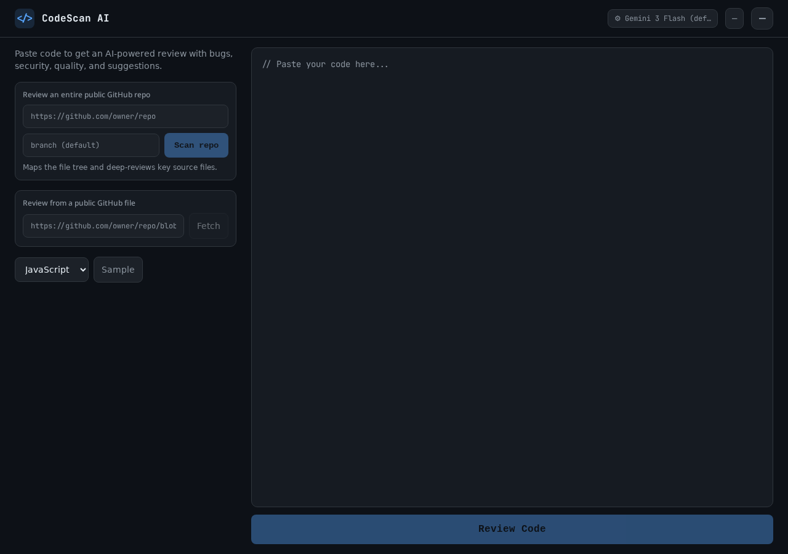
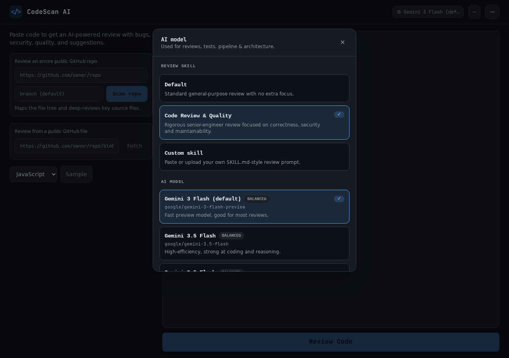
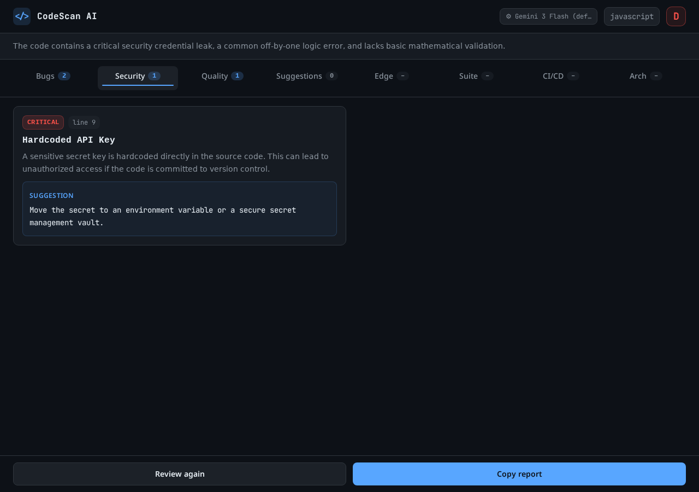
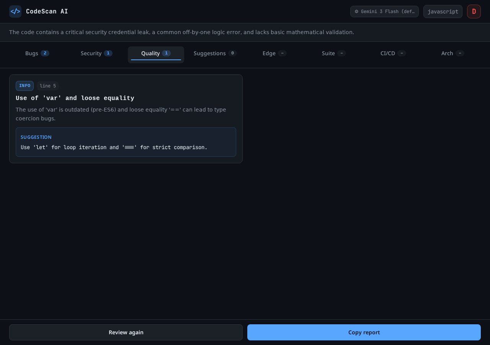
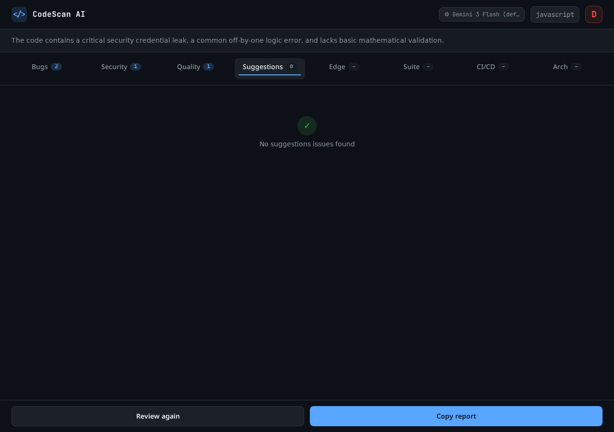
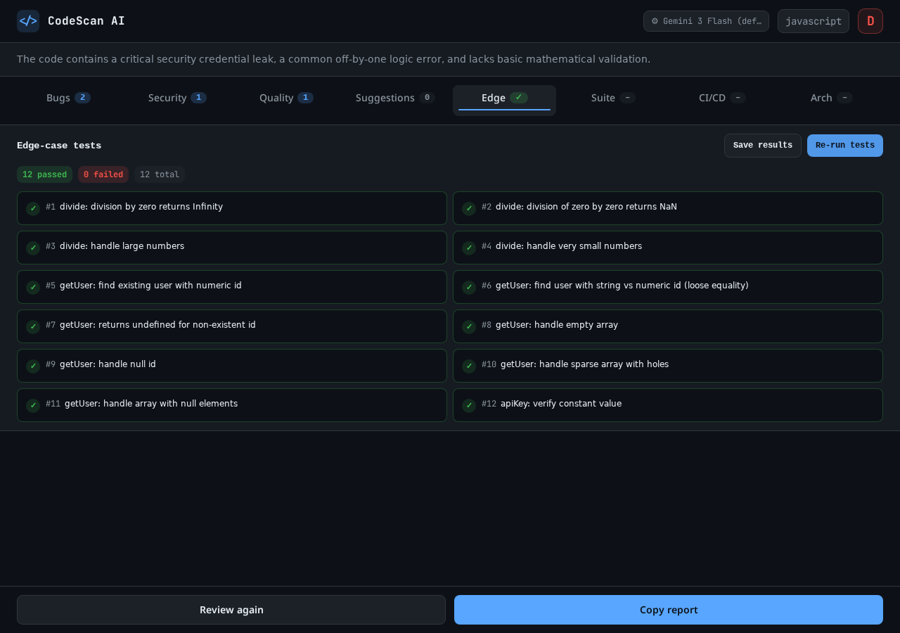
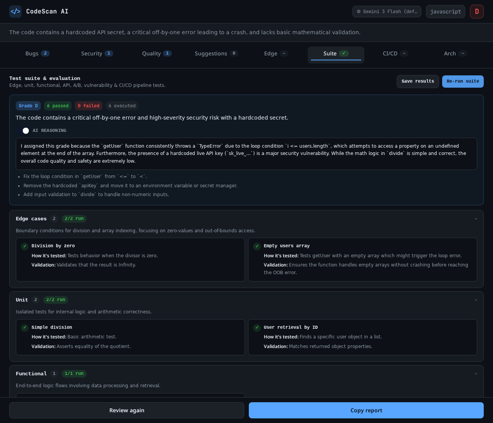
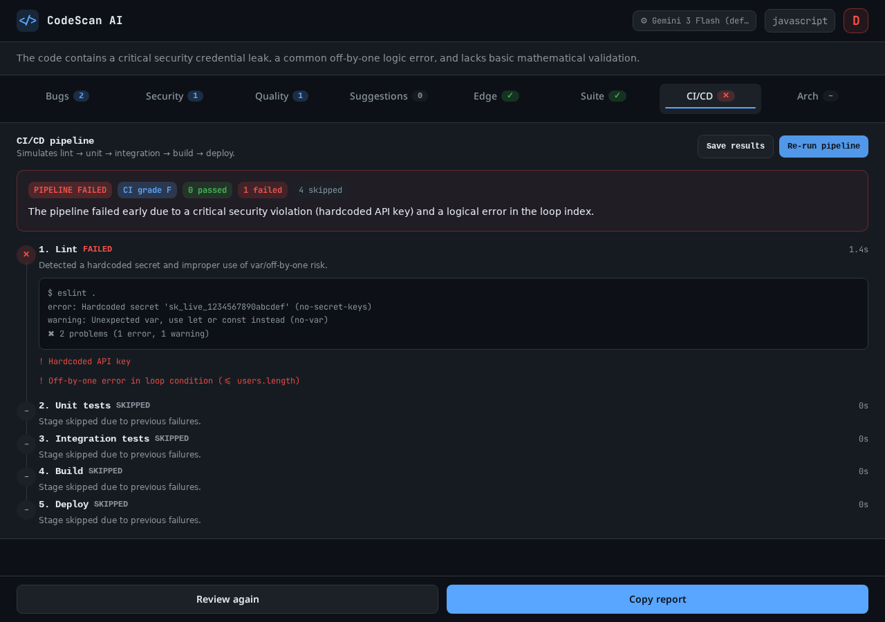
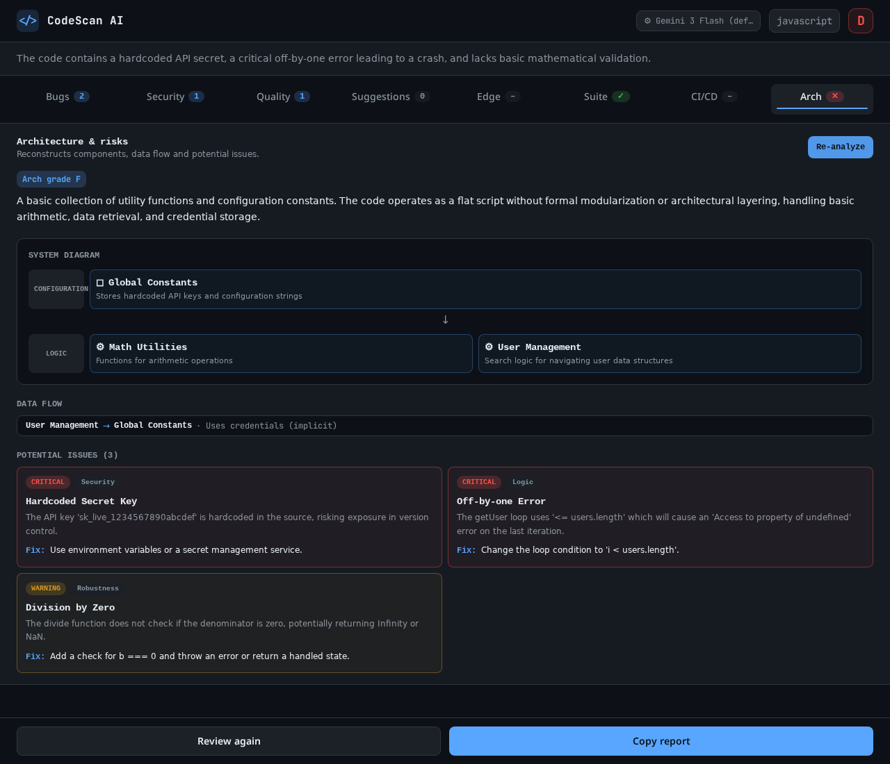

# CodeScan AI

**AI-powered code review, testing, and architecture analysis — in your browser.**

Paste a code snippet or point it at a public GitHub repository and CodeScan AI
finds bugs, security vulnerabilities, and quality issues, then generates and
runs tests, simulates a CI/CD pipeline, and reconstructs your architecture —
all powered by configurable AI models.




---

## Screenshots & Features

Each section below shows the actual UI for that capability.

### Start a review

Paste code directly, choose a language, or review an entire public GitHub repo
(or a single file) — then hit **Review Code**.



### Configure the AI model & review skill

Open the gear menu to pick the AI model used across reviews, tests, pipeline,
and architecture, and to select a **review skill** — Default, a rigorous
*Code Review & Quality* profile, or your own pasted/uploaded `SKILL.md`-style
prompt.



### 1. AI Code Review

Findings are grouped into four categories, each with a severity badge, line
number, description, and an actionable fix suggestion. An overall letter grade
(A+ → F) is shown in the top bar.

| Category | Description |
|----------|-------------|
| **Bugs** | Logic errors, potential runtime exceptions, incorrect behavior |
| **Security** | Vulnerabilities, injection risks, unsafe patterns |
| **Quality** | Code smell, maintainability, architecture concerns |
| **Suggestions** | Performance improvements, better practices, refactoring ideas |






### 2. Edge-Case Testing (JS/TS)

Generate boundary-condition tests with AI and run them safely in a browser
sandbox — empty/null inputs, boundary values, overflow, and tricky control
flow. Pass/fail status is shown per test, with downloadable results.



### 3. Full Test Suite & Evaluation

An AI-designed suite spanning seven categories (edge, unit, functional, API,
A/B, vulnerability, CI/CD) with an overall grade, AI reasoning toggle, and
actionable recommendations.



### 4. CI/CD Pipeline Simulation

Simulates `lint → unit → integration → build → deploy` with realistic
fail-fast behavior, per-stage logs, durations, and a final CI grade.



### 5. Architecture & Risk Mapping

Reconstructs components, data flow, and a system diagram from the code, then
surfaces potential architectural issues with severity and fixes.



### 6. GitHub Repository Analysis

Paste a public repo URL to map the file tree, detect language distribution,
deep-review key source files, and surface repository-wide findings — then run
tests, the suite, the pipeline, and architecture mapping on the key files.

### 7. Export & Share

Copy the full review as Markdown, and save edge-case, suite, and pipeline
results as downloadable `.txt` reports.

---

## Features

### 1. AI Code Review
Submit any code snippet or fetch an entire GitHub repository for a comprehensive AI-powered review. Reviews analyze across four core categories:

| Category | Description |
|----------|-------------|
| **Bugs** | Logic errors, potential runtime exceptions, incorrect behavior |
| **Security** | Vulnerabilities, injection risks, unsafe patterns |
| **Quality** | Code smell, maintainability, architecture concerns |
| **Suggestions** | Performance improvements, better practices, refactoring ideas |

Each finding includes:
- Severity level (Critical / Warning / Info)
- Title and detailed description
- Affected line number (when applicable)
- Actionable fix suggestion
- Overall letter grade (A+ through F)

### 2. GitHub Repository Analysis
Paste any public GitHub repo URL and CodeScan AI will:
- Fetch the full repository file tree
- Identify language distribution
- Intelligently select up to 6 key source files (entry points, routers, configs)
- Deep-review architecture, structure, and code quality
- Surface repository-wide security and quality issues

### 3. Full Test Suite & Evaluation
Generate and run a comprehensive AI-designed test suite covering **seven test categories**:

| Category | Description |
|----------|-------------|
| **Edge cases** | Boundary conditions, empty/null inputs, large values, tricky paths |
| **Unit** | Isolated function/class behaviour with deterministic assertions |
| **Functional** | End-to-end behaviour of a feature or flow |
| **API & endpoints** | Endpoint contract, request/response validation, status codes, schema, auth |
| **A/B testing** | Experiment design — variants, metrics, sample size, success criteria |
| **Vulnerability** | Security tests (injection, XSS, authz, secrets, unsafe deserialization) |
| **CI/CD pipeline** | Pipeline checks (build, lint, typecheck, test stage, deploy gates) |

Each test case shows:
- **How it's tested** — description of the test approach
- **Validation** — how results / endpoints / behaviour are validated
- **Pass/fail status** with detailed error messages for failures
- **Save results** as a downloadable `.txt` evaluation report

The evaluation panel includes:
- **Overall grade** (A+ through F)
- **Verdict** — AI assessment of test coverage and code testability
- **Reasoning toggle** — show/hide the AI's step-by-step reasoning behind the grade
- **Recommendations** — actionable improvements

### 4. CI/CD Pipeline Simulation
Simulate a full CI/CD pipeline with realistic fail-fast behaviour across five stages:

| Stage | Description |
|-------|-------------|
| **Lint** | Code style, formatting, and static analysis checks |
| **Unit** | Unit test execution and coverage validation |
| **Integration** | Integration test execution and API contract validation |
| **Build** | Compilation, bundling, and asset generation |
| **Deploy** | Deployment gate checks and environment readiness |

Features:
- **Fail-fast skipping** — once a stage fails, downstream stages are marked as skipped
- **Per-stage duration**, summary, logs, and issue lists
- **Final CI grade** (A through F) based on pipeline health
- **Collapsible log details** for each stage
- **Save results** and **Re-run pipeline** controls

### 5. Edge-Case Testing (JS/TS)
After any review, run automated edge-case tests that:
- Generate boundary-condition test cases via AI
- Execute tests safely in a browser sandbox
- Report pass/fail status for each individual test
- Show detailed error messages for failures
- **Save results** as a downloadable text report

Tests cover:
- Empty / null / undefined inputs
- Boundary values and edge conditions
- Large values and overflow scenarios
- Tricky control-flow paths

### 6. Export & Share
- Copy the full review report as Markdown to clipboard
- Save test suite evaluation results as `.txt` files
- Save CI/CD pipeline results as `.txt` files
- Save edge-case test results as `.txt` files

---

## Tech Stack

| Layer | Technology |
|-------|------------|
| Framework | [TanStack Start](https://tanstack.com/start) (v1) — Full-stack React with SSR |
| UI Library | React 19 |
| Language | TypeScript 5.8 (strict mode) |
| Styling | Tailwind CSS v4 |
| Components | Radix UI primitives + shadcn/ui |
| Animation | Framer Motion |
| State & Data | TanStack Query |
| AI Gateway | Lovable AI Gateway (Gemini 3 Flash) |
| Validation | Zod |
| Build Tool | Vite 7 |

---

## Project Structure

```
src/
├── routes/
│   ├── __root.tsx              # Root layout (HTML shell)
│   ├── index.tsx               # Main page — review UI, results, all panels
│   └── routeTree.gen.ts        # Auto-generated route tree (do not edit)
├── components/
│   └── codescan/
│       ├── TopBar.tsx          # Header with language & grade
│       ├── ManualInput.tsx     # Code editor + GitHub repo input form
│       ├── CategoryTabs.tsx    # Tab navigation (Bugs, Security, Quality, Suggestions, Edge, Suite, CI/CD)
│       ├── FindingCard.tsx     # Individual review finding card
│       ├── ScanningState.tsx   # Loading skeleton animation
│       ├── TestPanel.tsx       # Edge-case test runner & results display
│       ├── TestSuitePanel.tsx  # Full test suite & evaluation panel
│       ├── PipelinePanel.tsx   # CI/CD pipeline simulation panel
│       └── BottomBar.tsx       # Footer actions (Review again, Copy report)
├── lib/
│   ├── codescan-types.ts       # Shared TypeScript interfaces
│   ├── review.functions.ts     # Server function: single-file AI review
│   ├── repo-review.functions.ts# Server function: GitHub repo fetch + review
│   ├── test-runner.functions.ts# Server function: AI-generated edge-case tests
│   ├── test-suite.functions.ts # Server function: full test suite generation
│   ├── pipeline.functions.ts   # Server function: CI/CD pipeline simulation
│   ├── run-tests.ts            # Browser sandbox edge-case test executor
│   ├── run-suite.ts            # Browser sandbox full suite test executor
│   ├── report.ts               # Markdown report builder
│   └── ai-gateway.server.ts  # AI provider configuration (server-only)
├── router.tsx                  # TanStack Router setup
└── styles.css                  # Tailwind CSS entry + design tokens
```

---

## Getting Started

### Prerequisites
- [Bun](https://bun.sh/) (recommended) or Node.js 20+

### Installation

```bash
# Install dependencies
bun install

# Start development server
bun dev
```

The app will be available at `http://localhost:3000`.

### Environment Variables

Create a `.env` file in the project root:

```env
# Required — AI review, test generation, and pipeline simulation
LOVABLE_API_KEY=your_lovable_ai_gateway_key

# Optional — only needed if using Supabase/Lovable Cloud features
VITE_SUPABASE_URL=
VITE_SUPABASE_PUBLISHABLE_KEY=
```

> **Note:** `LOVABLE_API_KEY` is required for all AI-powered features to work.

---

## Usage

### Manual Code Review
1. Paste your code into the editor
2. Select the programming language
3. Click **Review code**
4. Browse findings by category (Bugs, Security, Quality, Suggestions)
5. Switch to the **Edge** tab to run edge-case tests (JS/TS only)
6. Switch to the **Suite** tab to generate and run the full test suite
7. Switch to the **CI/CD** tab to simulate the deployment pipeline
8. Click **Save results** to download any test or pipeline report

### Repository Review
1. Paste a public GitHub repository URL (e.g., `https://github.com/owner/repo`)
2. Optionally specify a branch (defaults to the repo's default branch)
3. Click **Review repository**
4. View the file tree, language breakdown, and AI findings
5. Run edge-case tests, the full test suite, and CI/CD pipeline on the key files

### Navigation Tabs
| Tab | Content |
|-----|---------|
| Bugs | Logic errors and runtime issues |
| Security | Vulnerabilities and unsafe patterns |
| Quality | Maintainability and architecture |
| Suggestions | Improvements and refactor ideas |
| Edge | Edge-case test runner (JS/TS) |
| Suite | Full test suite & AI evaluation |
| CI/CD | Pipeline simulation (lint → unit → integration → build → deploy) |

### Keyboard Shortcuts
| Action | Shortcut |
|--------|----------|
| Submit review | `Ctrl + Enter` (in code editor) |

---

## Architecture Notes

### Server Functions (`createServerFn`)
All AI operations run server-side via TanStack Start server functions:
- **`reviewCode`** — Analyzes a single code snippet
- **`reviewRepo`** — Fetches GitHub repo metadata + key files, then runs AI analysis
- **`generateEdgeCaseTests`** — Generates a JSON test plan with runnable JS assertions
- **`generateTestSuite`** — Generates a comprehensive 7-category test suite with evaluation
- **`runPipeline`** — Simulates CI/CD pipeline stages with fail-fast logic

These functions use the Lovable AI Gateway (Gemini 3 Flash) and return strictly-typed JSON responses.

### Client-Side Test Execution
Tests are executed in the **browser** (not the server) via a sandboxed `new Function()` approach with:
- 3-second timeout per test (`Promise.race`)
- Safe isolation — no DOM, network, or filesystem access
- Only supports JavaScript/TypeScript code that can be transpiled to plain JS

### GitHub Integration
Repository fetching uses the public GitHub API and raw content endpoints:
- **API calls:** `https://api.github.com/repos/{owner}/{repo}`
- **File tree:** `https://api.github.com/repos/{owner}/{repo}/git/trees/{branch}?recursive=1`
- **Raw files:** `https://raw.githubusercontent.com/{owner}/{repo}/{branch}/{path}`

No GitHub token is required for public repositories. Rate limits apply.

---

## Supported Languages

| Language | Review | Repo Analysis | Edge-Case Tests | Test Suite | CI/CD |
|----------|--------|---------------|-----------------|------------|-------|
| JavaScript | ✅ | ✅ | ✅ | ✅ | ✅ |
| TypeScript | ✅ | ✅ | ✅ | ✅ | ✅ |
| Python | ✅ | ✅ | ❌ | ℹ️ | ℹ️ |
| Go | ✅ | ✅ | ❌ | ℹ️ | ℹ️ |
| Rust | ✅ | ✅ | ❌ | ℹ️ | ℹ️ |
| Java | ✅ | ✅ | ❌ | ℹ️ | ℹ️ |
| C / C++ | ✅ | ✅ | ❌ | ℹ️ | ℹ️ |
| Ruby | ✅ | ✅ | ❌ | ℹ️ | ℹ️ |
| PHP | ✅ | ✅ | ❌ | ℹ️ | ℹ️ |
| C# | ✅ | ✅ | ❌ | ℹ️ | ℹ️ |
| Swift | ✅ | ✅ | ❌ | ℹ️ | ℹ️ |
| Kotlin | ✅ | ✅ | ❌ | ℹ️ | ℹ️ |

> **Legend:** ✅ Fully supported (executable tests) | ℹ️ Informational tests only (non-JS/TS languages generate test plans but cannot run in the browser JS sandbox)

---

## Deployment

### Vercel

This project is configured for deployment on **Vercel** using the `vercel-edge` preset.

#### Step 1: Push to GitHub
Make sure your code is in a GitHub repository:

```bash
git init
git add .
git commit -m "Initial commit"
git remote add origin https://github.com/YOUR_USERNAME/codescan-ai.git
git push -u origin main
```

#### Step 2: Import to Vercel
1. Go to [vercel.com](https://vercel.com) and sign in
2. Click **Add New Project**
3. Import your GitHub repository
4. Vercel will auto-detect Bun (via `packageManager` in `package.json`)

#### Step 3: Configure Environment Variables
In the Vercel dashboard for your project, go to **Settings → Environment Variables** and add:

| Variable | Value | Required |
|----------|-------|----------|
| `LOVABLE_API_KEY` | Your Lovable AI Gateway key | Yes |
| `VITE_SUPABASE_URL` | Your Supabase URL | Only if using Lovable Cloud |
| `VITE_SUPABASE_PUBLISHABLE_KEY` | Your Supabase publishable key | Only if using Lovable Cloud |

> **Important:** `LOVABLE_API_KEY` is required for AI features. Without it, reviews and tests will fail.

#### Step 4: Deploy
Click **Deploy**. Vercel will build and deploy your site automatically on every push to the main branch.

#### Build Configuration (already set)
- **Framework Preset:** Other (handled by `vercel.json`)
- **Build Command:** `bun run build`
- **Output Directory:** auto-detected by Nitro (`vercel-edge` preset)
- **Install Command:** `bun install`

The `vite.config.ts` in this repo already configures the `vercel-edge` Nitro preset for optimal SSR performance on Vercel's edge network.

> **Note:** When you run `bun run build` locally or in the Lovable sandbox, you'll see `wrangler.json` generated — this is because the Lovable config forces Cloudflare for preview builds. When Vercel runs the build on its own infrastructure, the `vercel-edge` preset takes effect and the output is correctly formatted for Vercel.

#### Troubleshooting
- **Build fails:** Ensure `LOVABLE_API_KEY` is set in Vercel environment variables
- **Rate limit errors:** The app handles 429 responses gracefully; wait a moment and retry
- **AI credits exhausted:** Check your Lovable workspace credits

### Lovable (Alternative)
You can also deploy directly from the Lovable editor:
1. Click **Publish** in the top-right corner
2. Your site will be live at a `.lovable.app` URL
3. Frontend changes require clicking **Update** to go live
4. Backend changes (server functions) deploy automatically

---

## Scripts

| Command | Description |
|---------|-------------|
| `bun dev` | Start development server with hot reload |
| `bun run build` | Production build |
| `bun run build:dev` | Development build |
| `bun run preview` | Preview production build locally |
| `bun run lint` | Run ESLint |
| `bun run format` | Format code with Prettier |

---

## Design Tokens

The app uses a custom dark-themed color system defined in `src/styles.css`:

| Token | Purpose |
|-------|---------|
| `--cs-bg` | Page background |
| `--cs-surface` | Card / panel surfaces |
| `--cs-text` | Primary text |
| `--cs-muted` | Secondary / helper text |
| `--cs-info` | Accent / action color |
| `--cs-success` | Positive states (passing tests) |
| `--cs-critical` | Negative states (failures, critical issues) |
| `--cs-warning` | Warning severity |

---

## License

MIT
